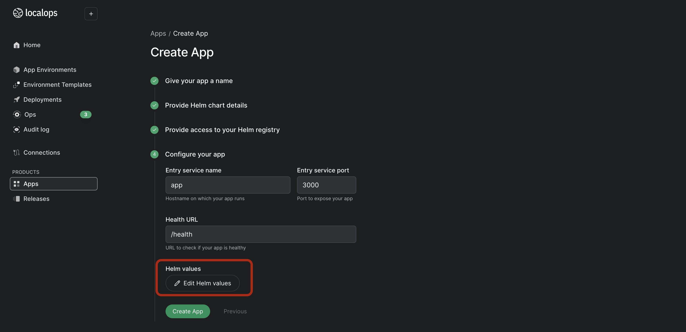
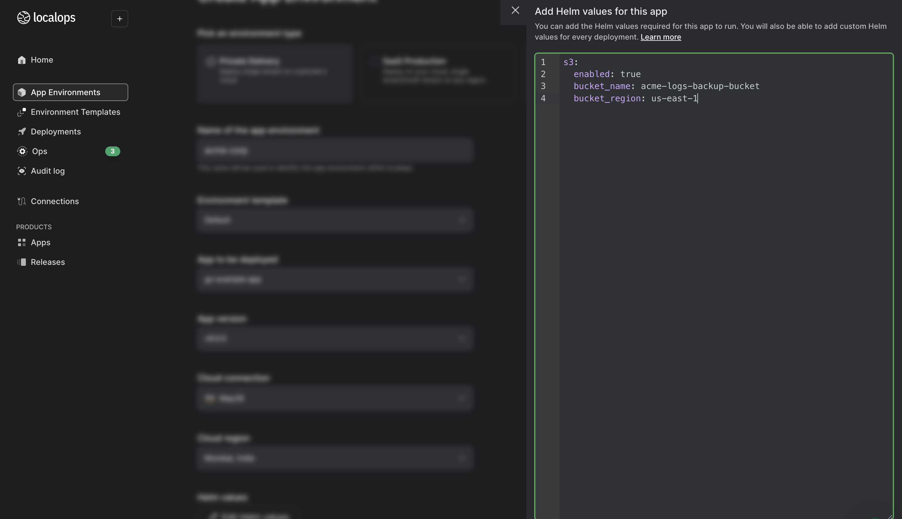

This guide will take you through

- Provisioning an S3 bucket as part of your application
- Accessing the bucket from within your application

## Provisioning an S3 Bucket

To create an S3 bucket, add a yaml template file like this to your helm chart.

```yaml
{{- if .Values.s3.enabled }}
apiVersion: s3.aws.upbound.io/v1beta1
kind: Bucket
metadata:
  name: { { .Values.s3.bucket_name } }
spec:
  forProvider:
    region: { { .Values.localops.region } }
    forceDestory: true
  providerConfigRef:
    name: default
{{- end }}
```

<Info>
  In the above YAML configuration, the S3 region is specified using the
  `localops.region` Helm value, which is passed by LocalOps. This ensures that
  the S3 region dynamically aligns with the App Environment region. For more
  info refer [this article](bring-your-app/environment-vars/localops-vars.md).
</Info>

When forceDestory is set to true all objects will be deleted from the bucket when the bucket is destroyed or when your application environment is archived. This enables the bucket to be destroyed without any errors. These objects are not recoverable.

<Tip>




You can conditionally provision an s3 bucket and configure it using Helm values, allowing you to customize or dynamically configure the deployment based on your environment or requirements. While you create an app or new deployments on Localops you can specify these helm values.

</Tip>

## Accessing the Bucket

We use the credentials provided in your cloud connection to create your managed cloud resource. These credentials are made available as a Kubernetes Secret named cloud-provider-secret in the namespace inside which your application runs. You can pass these credentials as environment variables to the container hosting your application image by adding them to the pod template specification in your Helm chart.

```yaml
apiVersion: apps/v1
kind: Deployment
metadata:
  name: acme-api-deployment
spec:
  replicas: 3
  selector:
    matchLabels:
      app: acme-api
  template:
    metadata:
      labels:
        app: acme-api
    spec:
      containers:
        - name: api-container
          image: public.ecr.aws/ach42q1u/acme-api:1.0.0
          ports:
            - containerPort: 8080
          env:
            - name: AWS_ACCESS_KEY_ID
              valueFrom:
                secretKeyRef:
                  name: cloud-provider-secret
                  key: aws_access_key_id
            - name: AWS_SECRET_ACCESS_KEY
              valueFrom:
                secretKeyRef:
                  name: cloud-provider-secret
                  key: aws_secret_access_key
```

Environment variables with keys AWS_ACCESS_KEY_ID and AWS_SECRET_ACCESS_KEY within the container that hosts your application image. You can read the environment variables with keys AWS_ACCESS_KEY_ID and AWS_SECRET_ACCESS_KEY exposed in the container and use these values from inside your application or use AWS SDKs which will utilize these environment variables by default to authenticate with AWS services.
