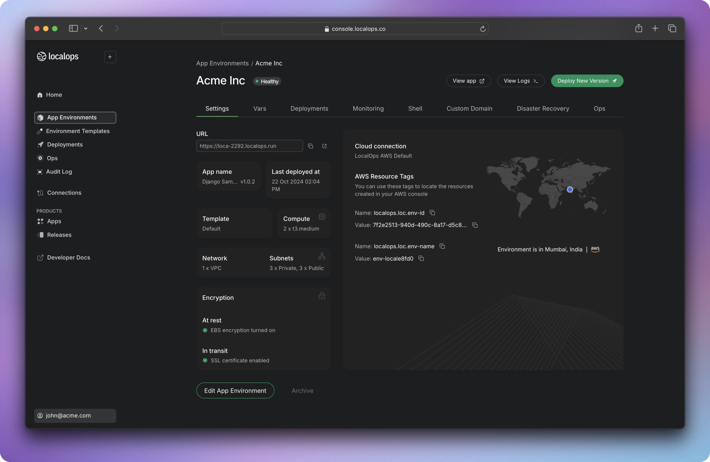

**LocalOps** is a cloud deployment automation tool that help you deploy your software products/web applications on your cloud or your customers cloud environment across major public cloud providers (such as AWS, Google Cloud and Azure) and automate all day-1/2 operations.

One can deploy, montior, make releases on any cloud deployment from a single dashboard - LocalOps dashboard.

This guide provides user manuals, tutorials and concepts to educate your dev/devops teams to start spinning up App environments anywhere.

Here are some places to start.

<CardGroup cols={2}>
  <Card title="Try our demo" icon="pen-to-square" href="https://mintlify.com/docs/quickstart">
    Checkout the demo app we made for you to explore localops
  </Card>

  <Card title="Core Concepts" icon="image" href="https://mintlify.com/docs/development">
    ### Learn core around localops so you can be more comfortable while going through docs.
  </Card>
</CardGroup>
